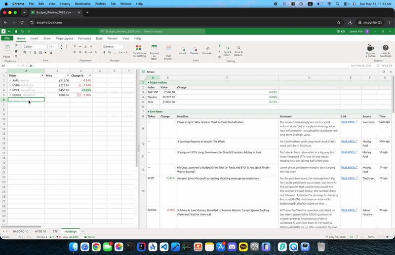
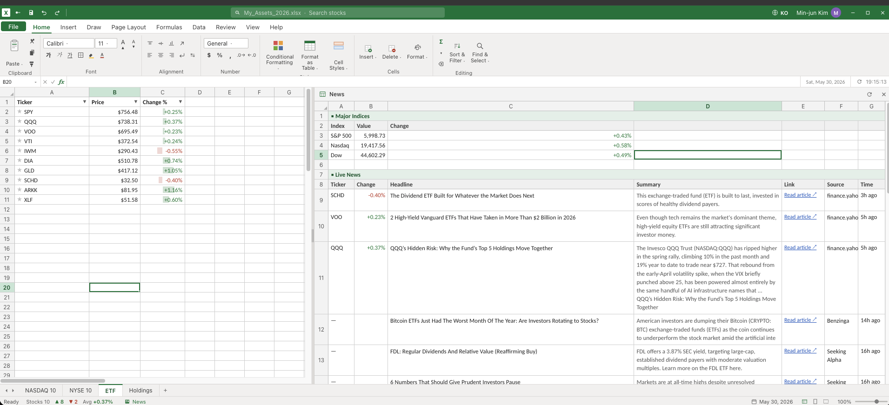

# excel-stock

**A live stock watchlist that looks exactly like a Microsoft Excel spreadsheet — so you can check the market at work without anyone noticing.**

It's a real-time tracker wearing an Excel 365 costume: column letters, the green ribbon, the formula bar, data bars, autofilter. Rows are tickers; the prices and % changes are live. Glance away and it vanishes.

> ⚠️ A fun side project, not investment advice. Quotes can be delayed — don't trade on them.

<p align="center">
  
</p>

## The trick

- **Boss key.** Hit the backtick (`` ` ``) and the whole screen becomes an innocent department-budget sheet — different filename, plausible numbers, news pane gone.
- **Auto-conceal.** The moment the window loses focus or the tab is hidden (alt-tab, app switch, you stepping away), it hides itself. It only ever *conceals* — revealing is a deliberate keypress, so an unattended screen never flips back to stocks on its own.
- **Disguised by default.** Even the browser tab title and favicon read as an `.xlsx` file.

## What it actually does

<p align="center">
  
</p>

- **Live watchlist** in a spreadsheet grid — inline edit the ticker column, keyboard nav, favorites (★) auto-build a watchlist sheet. Default sheets: NASDAQ-10, NYSE-10, ETFs, holdings.
- **Real index strip** (S&P 500 / Nasdaq / Dow) and a **live news pane**.
- **Bilingual EN / KO**, English by default — one toggle in the title bar.
- **Mock mode** runs fully offline with zero config (a random-walk provider), so you can try it in 30 seconds.

## Privacy & engineering notes

The parts that make it more than a toy:

- **No API keys in the client bundle.** All market/news data flows through same-origin `/api/*` proxy functions; secrets live only in server-side env vars. (`grep` the built `dist/` for your key → 0 matches.)
- **Built to survive a spike.** The shared default watchlist is served by one **keyless, batched** request (Stooq), TTL-cached and request-coalesced, so upstream load is *(symbols ÷ TTL)* — independent of how many people are watching. Edge caching (`s-maxage` + `stale-while-revalidate`) sits on top. Arbitrary user-added symbols use a real-time provider (Finnhub). See [`DEPLOY.md`](DEPLOY.md).
- **Hardened proxy.** Same-origin gate + per-IP rate limit; the news-source resolver is SSRF-hardened (rejects private/loopback hosts, never fetches redirect targets).

## Stack

Vite · React · TypeScript · a hand-built CSS-grid Excel chrome (no grid library). Quote/news data comes through a pluggable provider adapter; deploys to Vercel (functions for `/api/*`).

## Quick start

```bash
npm install
npm run dev      # http://localhost:5173 — runs on the offline mock provider
```

That's it for the demo. For **live data**, copy `.env.example` to `.env` and add the keys you have:

```bash
cp .env.example .env
# set VITE_QUOTE_PROVIDER=finnhub and FINNHUB_API_KEY=... (see below)
```

| Variable | For | Notes |
|---|---|---|
| `VITE_QUOTE_PROVIDER` | live mode | `mock` (default) or `finnhub`. Client-visible (not a secret). |
| `FINNHUB_API_KEY` | quotes + EN news | **server-side secret** |
| `MARKETAUX_API_TOKEN` | EN news | server-side secret (optional) |
| `NAVER_CLIENT_ID` / `NAVER_CLIENT_SECRET` | KO news | server-side secrets (optional) |
| `VITE_REFRESH_MS` | optional | quote poll interval (default 15000) |

The proxy enables each source whose key(s) are present and falls back to mock/empty otherwise. Full env + the spike-hardening dial (`QUOTE_TTL_MS`) and the production checklist are in [`DEPLOY.md`](DEPLOY.md).

## Commands

```bash
npm run dev        # dev server (mock provider, or live if .env is set)
npm run build      # typecheck + production build to dist/
npm run preview    # serve the production build
npm run typecheck  # type-check only
```

## License

[MIT](LICENSE) — do whatever, no warranty. Not affiliated with Microsoft; "Excel" is a trademark of Microsoft, used here only to describe the look.
